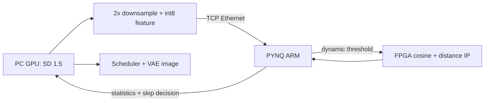

# SD-v1.5 Speed-up with PYNQ-Z2

基于时间步特征余弦相似度和归一化特征距离的 Stable Diffusion 1.5 动态跳步加速项目。

Stable Diffusion 的 CLIP、UNet、Scheduler 和 VAE 在 PC GPU 上运行。PC 每个扩散时间步先去除重复 CFG batch，执行 `2x2` 平均池化，再将 latent 特征量化为 int8 并通过以太网发送给 PYNQ-Z2。PYNQ ARM 维护三阶段动态阈值、相邻步余弦 EMA 和参数状态。FPGA 使用片上 BRAM 保存参考特征，并完成点积、范数、余弦阈值、归一化距离阈值、warmup、连续跳步限制和参考更新。



## 稳定版本

原始 CSK2/int16 稳定版本永久保存在 Git 标签 [`v1.0-csk2`](https://github.com/vigourway-boop/SD-v1.5-speed-up/tree/v1.0-csk2)。CSK3/int8 和 PC 端动态阈值的开发记录保存在 `feature/int8-skip-controller` 分支。CSK4 板端动态控制器与双重判定在 `feature/pynq-board-controller-distance` 分支开发，旧版本不会被覆盖。

## v1.0-csk2 已验证结果

硬件平台：RTX 4060 Laptop GPU + PYNQ-Z2，SD 1.5，100 个基础扩散时间步。

| 指标 | 结果 |
| --- | ---: |
| Baseline 时间 | 10.88 s |
| PYNQ 动态时间 | 4.57 s |
| 加速比 | 2.38x |
| UNet 执行/跳过 | 38 / 62 |
| 平均 PYNQ 往返 | 2.174 ms |
| PSNR | 29.199 dB |
| SSIM | 0.951994 |
| LPIPS | 0.025454 |
| CLIP Score（baseline / dynamic） | 32.409 / 32.466 |

动态时间包含 PC 特征量化、以太网传输、PYNQ 服务、FPGA 判断和扩散过程。PSNR、SSIM、LPIPS 和 CLIP Score 在生成计时结束后计算，不计入加速比。

验证图片和完整 CSV/JSON 数据位于 [`examples/verified_run`](examples/verified_run)。

## CSK3/int8 固定阈值结果

硬件平台：RTX 4060 Laptop GPU + PYNQ-Z2，SD 1.5，100 个基础扩散时间步，随机种子 `3669225787`。

| 指标 | 结果 |
| --- | ---: |
| Baseline 时间 | 11.10 s |
| PYNQ 动态时间 | 4.70 s |
| 加速比 | 2.36x |
| UNet 执行/跳过 | 39 / 61 |
| 每步特征载荷 | 4096 B |
| 平均板端 FPGA 调用时间 | 0.573 ms |
| 平均网络往返 | 1.486 ms |
| PSNR | 30.246 dB |
| SSIM | 0.921491 |
| LPIPS | 0.048996 |
| CLIP Score（baseline / dynamic） | 30.502 / 30.382 |

CSK3 将每步传输量从 CSK2 的 32768 B 降至 4096 B，并把 warmup、余弦阈值、最大连续跳步、跳步计数和参考更新都放入 FPGA。动态时间包含特征下采样、int8 量化、传输、FPGA 判断和扩散过程。表中的板端 FPGA 调用时间还包含 ARM 侧 MMIO 寄存器读写；HLS 核心综合最大延迟为 82.29 us。

本次验证的图片和完整 100 步 CSV/JSON 数据位于 [`examples/csk3_int8_run`](examples/csk3_int8_run)。

## 动态阈值结果

动态阈值参数来自 8 组真实 CSK3 固定阈值实验，不是根据单张图片指定。连续跳步相似度中位数分别为：第 1 次 `0.999822`、第 2 次 `0.999499`、第 3 次 `0.999218`。据此采用三个阶段：

- 第 1-15 步：FPGA warmup 强制不跳。
- 第 16-70 步：严格阈值 `0.99960`。
- 第 71-100 步：`相邻时间步相似度 EMA - 0.00035`，并限制在 `0.99945-0.99965`。

5 个相同随机种子的固定/动态成对实验结果：

| 指标（5 组中位数） | 固定 0.999 | 动态阈值 |
| --- | ---: | ---: |
| PSNR | 25.23 dB | 27.35 dB |
| SSIM | 0.866 | 0.900 |
| LPIPS | 0.074 | 0.044 |
| 加速比 | 2.35x | 1.84x |
| 跳步数 | 61 | 49 |

5 组动态实验的 PSNR、SSIM 和 LPIPS 均同时改善，且都没有发生第 3 次连续跳步。动态阈值牺牲一部分速度，换取更稳定的生成轨迹。完整定参和逐种子结果见 [`DYNAMIC_THRESHOLD_EVALUATION.md`](DYNAMIC_THRESHOLD_EVALUATION.md)，代表性实验位于 [`examples/dynamic_threshold_run`](examples/dynamic_threshold_run)。

## CSK4 板端控制与双重判定

CSK4 只在启动时由 PC 发送一次完整控制参数。之后每步 PC 只发送 `step_index` 和 4096 字节的 int8 特征：

- PYNQ ARM：选择 warmup/middle/late 阶段，维护相邻步余弦 EMA，计算并钳位动态余弦阈值。
- FPGA：计算点积和两个范数，通过无除法的定点比较完成余弦与归一化距离判断。
- FPGA：仅当 `cosine_passed && distance_passed`，并满足 warmup 和最大连续跳步限制时返回跳步。

归一化距离定义为：

```text
distance = (norm_x + norm_y - 2 * dot) / (norm_x + norm_y)
```

FPGA 使用 Q20 阈值交叉相乘，不执行除法。默认 `SD_DISTANCE_THRESHOLD=2.0` 是采集和兼容阶段的宽松阈值，不影响原余弦控制结果；它不代表质量安全阈值。

修复命令行 seed 传递后，项目完成了 3 个固定 seed x 3 个距离阈值的有效校准。`0.00035` 在候选中最好，平均加速 `1.729x`、平均 PSNR `33.192 dB`，但最差 seed 的 PSNR 只有 `23.747 dB`。进一步收紧到 `0.00015`、只跳 21 步时，该 seed 的 PSNR 仍只有 `24.455 dB`。因此当前不提升任何候选为默认值，下一步需要修改跳步策略本身，而不是继续微调单一全局距离阈值。完整数据见 [`DISTANCE_THRESHOLD_EVALUATION.md`](DISTANCE_THRESHOLD_EVALUATION.md)。

## 目录

```text
combined_speed_test.py       一键 baseline + PYNQ 动态生成与评估
config.py                    模型、提示词、随机种子和跳步参数
dynamic_threshold.py         三阶段动态阈值和在线 EMA 控制器
pynq_protocol.py             PC 与 PYNQ 共用的 CSK4 二进制协议
pynq_cosine_client.py        PC 端特征压缩和 CSK4 客户端
quality_metrics.py           PSNR、SSIM、LPIPS、CLIP Score
run_pynq_speedup.cmd         Windows 一键运行入口
deploy_pynq_server.cmd       部署 bit/hwh 和板端服务
test_pynq_protocol.py        本地协议测试
test_dynamic_threshold.py    动态阈值阶段、EMA 和边界测试
test_config.py               显式随机种子的复现与差异测试
test_pynq_hardware.py        真实 PYNQ/FPGA 测试
pynq_cosine_overlay/
  hls/src/                   HLS C++ IP 源码和测试台
  vivado/                    Vivado Block Design 构建脚本
  artifacts/                 bit、hwh、IP 导出包、Notebook 和板端服务
```

## 环境要求

- Windows 10/11
- Python 3.10 和 Conda
- NVIDIA CUDA GPU，当前验证环境为 CUDA 11.8
- PYNQ-Z2，默认地址 `192.168.2.99`
- Vivado/Vitis HLS 2022.2，仅重新生成 FPGA 产物时需要

Stable Diffusion 模型权重不会存放在本仓库中，首次运行会从 Hugging Face 下载 `runwayml/stable-diffusion-v1-5`。

## PC 安装

```bat
conda create -n sd_accel python=3.10 -y
conda activate sd_accel
pip install torch==2.7.1 torchvision==0.22.1 --index-url https://download.pytorch.org/whl/cu118
pip install -r requirements.txt
```

如果 Conda 或 Python 安装位置不同，请修改 `run_pynq_speedup.cmd` 中的 `SD_PYTHON`，或者先激活 `sd_accel` 环境。

## 部署 PYNQ 服务

确保 PC 可以连接 PYNQ 的 SSH 端口，然后在项目根目录运行：

```bat
deploy_pynq_server.cmd 192.168.2.99 xilinx
```

该命令会上传 `cosine_overlay.bit/.hwh`、板端服务、动态阈值控制器和共享协议，安装并启动 `pynq-cosine.service`。SSH 和 sudo 可能要求输入 PYNQ 密码。不要将密码、Token 或 SSH 私钥提交到仓库。

## 一键生成与评估

```bat
run_pynq_speedup.cmd 192.168.2.99
```

每次运行都会使用一个新的随机种子；同一次运行中的 baseline 和 dynamic 使用相同种子，以保证比较公平。输出目录格式为：

```text
experiments/YYYYMMDD_HHMMSS_seed_<seed>/
  baseline.png
  pynq_dynamic.png
  step_metrics.csv
  summary.json
  quality_metrics.json
```

`step_metrics.csv` 每个扩散时间步一行，包含余弦相似度、归一化距离、两个通过标志、板端请求阈值、Q1.15/Q20 编码、阈值阶段、在线 EMA、跳步结果、量化时间、网络往返时间、FPGA kernel 时间、UNet 时间和 Scheduler 时间。第一步还没有参考向量，因此 similarity 和 normalized_distance 为 `NaN`。

需要复现实验种子或临时回到固定阈值时，可以在当前 CMD 中设置：

```bat
set SD_SEED=3669225787
set SD_DYNAMIC_THRESHOLD=0
set SD_DISTANCE_THRESHOLD=2.0
```

默认 `SD_DYNAMIC_THRESHOLD=1`。CSK4 动态阈值在 PYNQ ARM 上计算，余弦和距离比较在 FPGA 上完成，因此必须配套部署本分支生成的 CSK4 bit/hwh 和板端服务。

需要做可复现的距离门限 A/B 实验时，可以直接指定：

```bat
D:\lenovo\download\conda\envs\sd_accel\python.exe combined_speed_test.py --with-baseline --pynq-host 192.168.2.99 --seed 2499984135 --distance-threshold 0.0004
```

距离门限采样和候选结果见 [`DISTANCE_THRESHOLD_EVALUATION.md`](DISTANCE_THRESHOLD_EVALUATION.md)。

## 测试

本地协议测试：

```bat
python -m unittest -v test_config.py test_dynamic_threshold.py test_pynq_protocol.py
```

真实 FPGA 测试：

```bat
python test_pynq_hardware.py --host 192.168.2.99
```

硬件测试会验证：首次无参考向量、相同向量通过两项测试、最大连续跳步限制、不同向量不通过余弦阈值、近似向量通过余弦但被距离门限拒绝，以及 FPGA 统计结果与 PC int8 参考计算一致。

## 重新生成 FPGA 产物

```bat
D:\path\to\Vitis_HLS\2022.2\bin\vitis_hls.bat -f pynq_cosine_overlay\hls\run_hls.tcl
D:\path\to\Vivado\2022.2\bin\vivado.bat -mode batch -source pynq_cosine_overlay\vivado\create_overlay.tcl
```

已生成的 PYNQ-Z2 文件位于 [`pynq_cosine_overlay/artifacts`](pynq_cosine_overlay/artifacts)。构建状态和寄存器地址见 [`pynq_cosine_overlay/BUILD_STATUS.txt`](pynq_cosine_overlay/BUILD_STATUS.txt)。

## 限制

PYNQ-Z2 负责动态阈值状态、压缩特征统计和完整跳步控制。完整 CLIP、UNet 和 VAE 的参数量及带宽需求远超 Zynq-7020 的资源，因此仍由 PC GPU 执行。当前距离阈值 `2.0` 只用于采集和兼容；校准已证明单一全局距离阈值不能避免所有种子的轨迹退化。正式性能结论还必须覆盖更多随机种子、不同提示词和场景。
