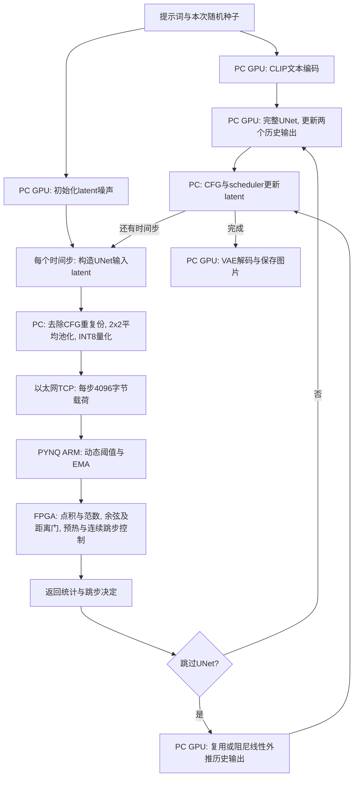
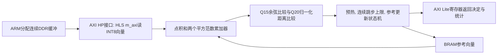

# 项目技术说明与完成情况

## 目标与结论边界

以《基于时间步相似性的生成模型推理加速》的项目简介为准：利用相邻时间步的数据相似性，量化与统计差异，复用共性计算，减少计算和数据开销，在GPU或FPGA至少一种平台验证不低于2倍加速。

项目简介没有强制要求把UNet卷积、CLIP或VAE完整放入PYNQ-Z2，也没有要求完整复现CacheQuant或Ditto。它们是参考研究。当前实现是GPU扩散与PYNQ相似性控制协同的算法原型。

关键限定：相对原始100步的加速，不等于相对日常20～30步SD1.5的加速。SD1.5常见为20～50步；DPM-Solver通常优先测试20～30步。100步不是质量真值，步数增加可能只增加耗时。应结合常用步数对照以及视觉检查判断实用价值。

## 数据流

这里比较的是UNet输入latent，不是UNet内部up-block特征。跳过的是部分UNet调用，scheduler仍走完整时间步序列。跳步后下一轮参考不自动更新；FPGA保留最近一次真实UNet对应的压缩输入作为参考。

## FPGA结构

当前数据通路通过HLS的AXI master直接读DDR，不含独立AXI DMA IP。不能将ARM调用IP的计时直接说成纯硬件执行周期。

## 代码位置

| 位置 | 内容 |
|---|---|
| `config.py` | 模型、提示词、原有默认参数 |
| `combined_speed_test.py` | 原始和动态扩散、计时、输出报告 |
| `skip_predictor.py` | 两次真实UNet输出的缓存与线性外推 |
| `dynamic_threshold.py` | 预热/中期/后期阈值和EMA |
| `pynq_cosine_client.py`、`pynq_protocol.py` | 特征压缩、TCP客户端、CSK4消息结构 |
| `pc_skip_controller.py`、`decision_backend.py` | 无板卡后备与软件对照 |
| `controller_profile.py`、`profiles/` | 可选参数文件与校验 |
| `project_health.py`、`launch_speedup.py`、`run_project.cmd` | 启动检查与调用原有生成入口 |
| `quality_metrics.py`、`experiment_report.py` | 画质指标与单组HTML报告 |
| `temporal_evaluation.py`、`temporal_report.py` | 第一轮多提示词实验和汇总 |
| `robustness_evaluation.py` | 已知失败案例调参及全新提示词验证 |
| `practical_steps_evaluation.py` | 原始20/30/50步与动态100步对照 |
| `pynq_cosine_overlay/hls/src/cosine_skip.cpp` | FPGA余弦、距离和状态机C++实现 |
| `pynq_cosine_overlay/vivado/create_overlay.tcl` | Vivado系统连接脚本 |
| `pynq_cosine_overlay/artifacts/` | bit/hwh、导出IP、Notebook、板端服务 |

## 已验证的硬件证据

现有构建记录 `pynq_cosine_overlay/BUILD_STATUS.txt`：Zynq-7020、100MHz、HLS C仿真/综合/IP导出、Vivado实现和bitstream生成通过；最终WNS为+0.315ns。利用率LUT 7.35%、FF 4.10%、BRAM 1.07%、DSP 34.09%。HLS报告最大延迟8229周期是工具估计，不是板上周期计数器实测。

已有908步软件/真实FPGA回放完全一致，6组完整生成的跳步序列和图片哈希相同。软件控制器平均含压缩0.130ms，板端含压缩和通信1.728ms；板卡目前没有比电脑计算这个小向量更快。系统加速主要来自GPU少执行UNet。

## 存储与质量

单份FP16 latent有32768字节，压缩后4096字节，特征载荷减少8倍。每图动态噪声缓存约128KiB。显存峰值约2675MiB，基本没有降低；没有权重量化或模型存储缩小的证据。

INT8逐步独立缩放，会丢失整体幅值信息；量化零差值比例不能直接转化成UNet卷积稀疏加速比例。只比较余弦和量化距离不能保证UNet输出误差很小，这是当前画质稳定性的核心限制。

PSNR/SSIM/LPIPS以原始100步为参考，只是相似度指标；CLIP衡量文本对齐，不保证结构正确。不能以一个高分宣布图片“完美”，也不能把20步与100步不同直接判为画质差。

## 尚缺的证据与合理后续

1. 在目标画质相近时，是否优于普通20～30步DPM-Solver，需要以常用步数实验结论为准。达不到时不能改用过慢基准掩盖。
2. 独立验证仍较小，不能保证所有提示词、种子、采样器或分辨率。更换采样器尤其要重新验证预测器和scheduler兼容性。
3. 板卡功耗、整机功耗与每图能量未测；软件层不能凭空提供这些实测数值。
4. 硬件纯周期实测及C/RTL协同仿真尚未补齐。下一版硬件可增加计数器，但它不会直接解决图像质量。
5. 若继续提高实用速度，优先研究短步数的复用误差预测、UNet内部局部缓存或更有效的采样基准。按提示词关键词切参数没有可靠泛化证据，暂不引入。

本项目的“已运行”“速度达标”“画质足够稳定”“FPGA有净收益”是四个不同结论，应逐项报告。
